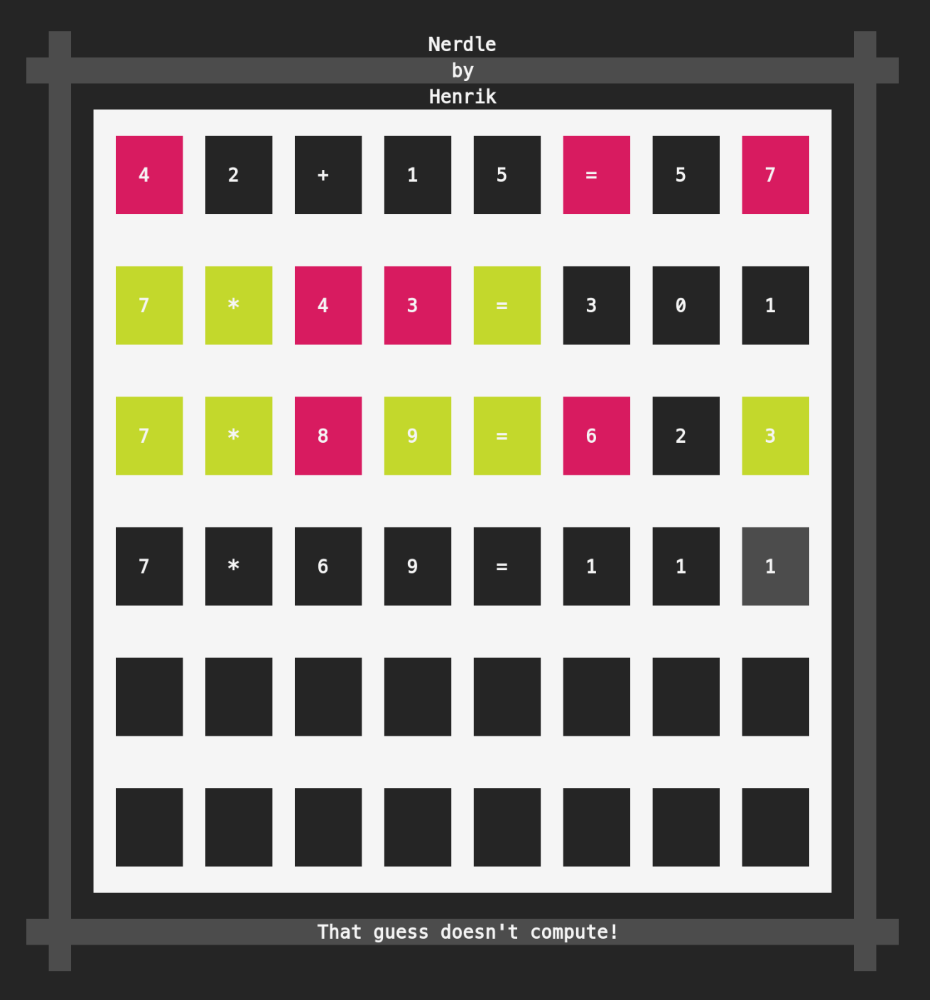

# Nerdle

This is the final project of a programming lecture "Advanced programming in C++" at the Albert Ludwigs University of Freiburg, written in C++17.
Like the name suggests, Nerdle is inspired by Wordle, but instead of a word, the player has to guess a simple equation.

Below, you can see an example game state.

# Dependencies

No external dependencies.

# Run

Compile the binary by running the Makefile:

    make compile

and then run the executable:

    ./NerdleMain
